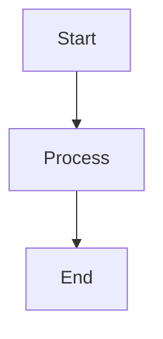
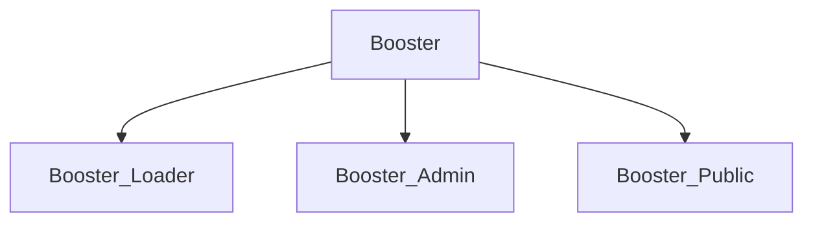
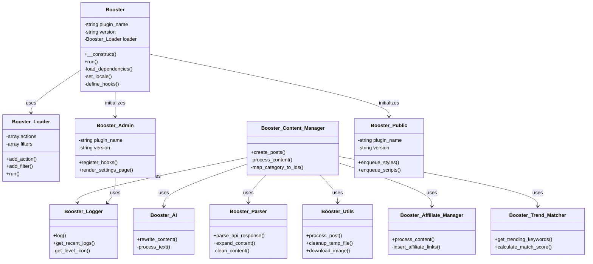
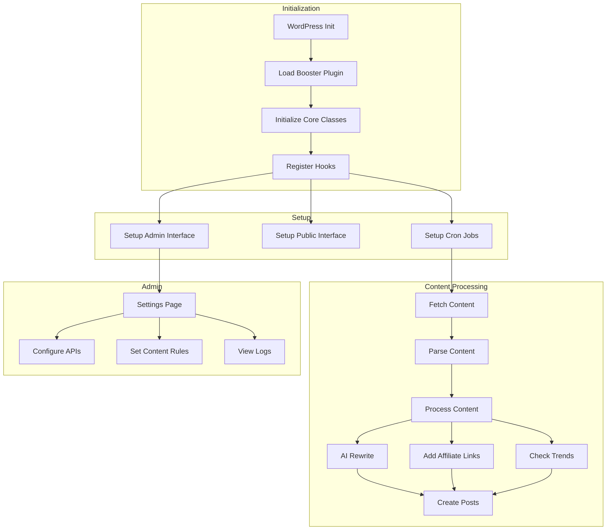
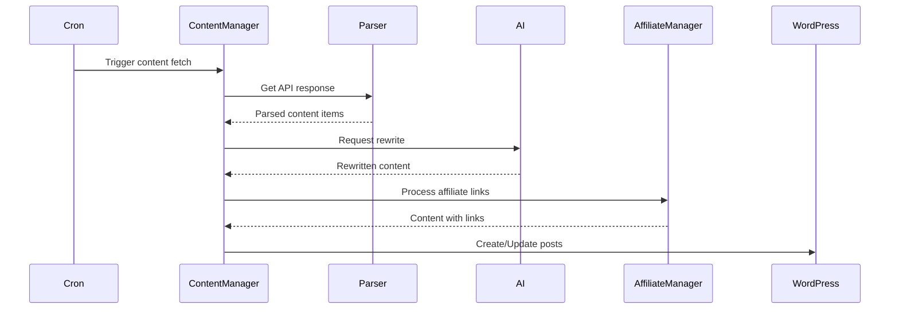
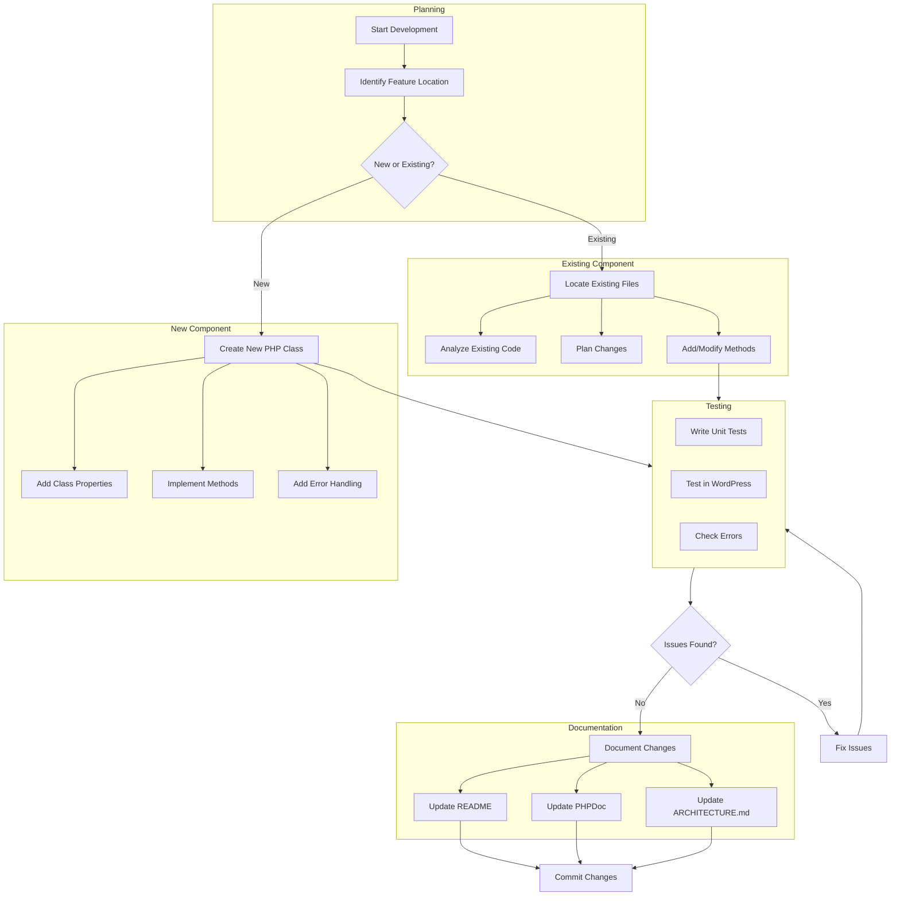
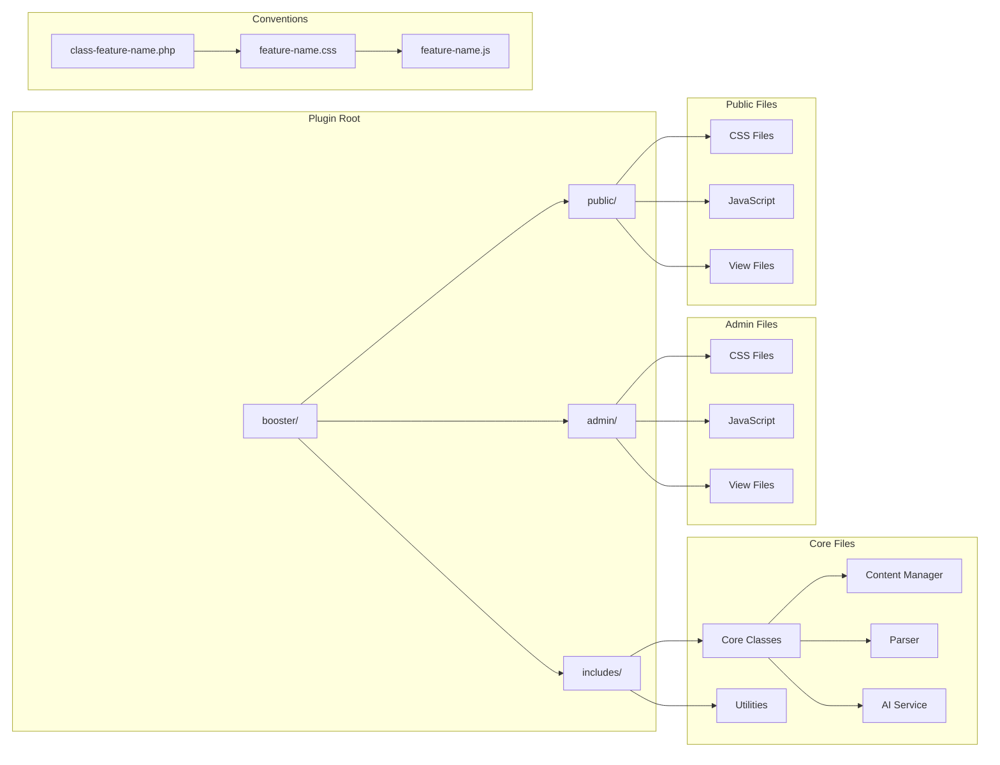

# Booster Plugin Architecture

This document outlines the architecture of the Booster WordPress plugin using Mermaid diagrams.

## Test Diagram



## Detailed Class Structure



> To view and interact with diagrams:
>
> 1. Open this file in VS Code
> 2. Press Ctrl+K V (or Cmd+K V on Mac) to open preview side-by-side
> 3. Click any diagram to enter interactive mode
> 4. In interactive mode:
>    - Use mouse wheel to zoom
>    - Drag to pan
>    - Double-click to reset view

## Class Structure



## Plugin Flow



## Data Flow



## Development Workflow

### Adding New Features



### Directory Structure



### Best Practices

```mermaid
%%{init: { 'flowchart': {'nodeSpacing': 30}} }%%
flowchart LR
    subgraph "Code Standards"
        direction TB
        A[PSR-12 Coding Style]
        B[WordPress Coding Standards]
        C[Type Declarations]
    end
    
    subgraph "Error Handling"
        direction TB
        D[Use Booster_Logger]
        E[Proper Exception Handling]
        F[Input Validation]
    end
    
    subgraph "Security"
        direction TB
        G[Data Sanitization]
        H[Capability Checks]
        I[Nonce Verification]
    end
    
    A & B & C --> J[Quality Code]
    D & E & F --> K[Reliable Code]
    G & H & I --> L[Secure Code]
